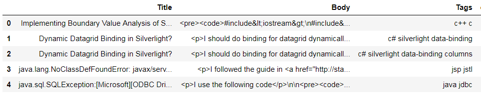
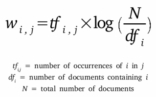

# Stack Overflow Tag Prediction

## I. Definition
### Project Overview
Stack Overflow is the largest, most trusted online community for developers to learn, share their programming knowledge, and build their careers.

Stack Overflow is something which every programmer use one way or another. Each month, over 50 million developers come to Stack Overflow to learn, share their knowledge, and build their careers. It features questions and answers on a wide range of topics in computer programming. The website serves as a platform for users to ask and answer questions, and, through membership and active participation, to vote questions and answers up or down and edit questions and answers in a fashion similar to a wiki or Digg. As of April 2014 Stack Overflow has over 4,000,000 registered users, and it exceeded 10,000,000 questions in late August 2015. Based on the type of tags assigned to questions, the top eight most discussed topics on the site are: Java, JavaScript, C#, PHP, Android, jQuery, Python and HTML.

### Problem Statement
Suggest the tags based on the content that was present in the question posted on Stackoverflow.

### Metrics
In order to evaluate the model, we will use the micro F1 score to test accuracy.
Micro-Averaged F1-Score (Mean F Score) : The F1 score can be interpreted as a weighted average of the precision and recall, where an F1 score reaches its best value at 1 and worst score at 0. The relative contribution of precision and recall to the F1 score are equal. The formula for the F1 score is:

```math
F1 = 2 * precision*recall / (precision + recall)
```
In the multi-class and multi-label case, this is the weighted average of the F1 score of each class. 
'Micro f1 score': 
Calculate metrics globally by counting the total true positives, false negatives and false positives. This is a better metric when we have class imbalance. 

## II. Analysis

### Data Exploration

The dataset contains 6,034,195 rows. The columns in the table are:
  * Id - Unique identifier for each question
  * Title - The question's title
  * Body - The body of the question
  * Tags - The tags associated with the question in a space-seperated format (all lowercase, should not contain tabs '\t' or ampersands     '&')
<p align="center">

</p>

Tags are predicted using Body of the question and Title which is an unstructured data. We can Identify the question using the Unique Id feature. 
As working with such a huge data set entails many computational limitations, so decided to use only a subset of the data.
There are 42048 number of unique tags. ".a, .app, .asp.net-mvc, .aspxauth, .bash-profile, .class-file, .cs-file, .doc, .drv, .ds-store" are some of the tags. By seeing the tags we can say the questions are all related to computer programming. 

<h5>Below is the distribution of tags</h5>

<p align="center">

</p>

<h5>Word cloud of Frequent tags</h5>
<p align="center">

</p>

  * Majority of the most frequent tags are programming language.
  * C# is the top most frequent programming language.
  * Android, IOS, Linux and windows are among the top most frequent operating systems.
  
 

## III. Methodology
### Data Cleaning and Preprocessing

In order to train our model, we had to transform the questions into the right format. We performed the following steps:
  
  * Sample 0.5M data points due to computation limitation.
  * Separate out code-snippets from Body
  * Removed Special characters from Question title and description (not in code)
  * Removed stop words (Except 'C')
  * Removed HTML Tags
  * Convert all the characters into small letters
  * Use SnowballStemmer to stem the word

### Implementation

#### Converting the Tags for MultiLabel problem

For Example:
 * x1 = {Java, Javascript}
 * x2 = {C}
 * x3 = {Java}
 * Y = {C, Java, Javascript, C##}

<table align = "center">
<tr>
<th>X</th><th>y1</th><th>y2</th><th>y3</th><th>y4</th>
</tr>
<tr>
<td>x1</td><td>0</td><td>1</td><td>1</td><td>0</td>
</tr>
<tr>
<td>x2</td><td>1</td><td>0</td><td>0</td><td>0</td>
</tr>
<tr>
<td>x3</td><td>0</td><td>1</td><td>0</td><td>0</td>
</tr>
</table>
 
 Sample the number of tags instead of considering all of the tags due to the computation limit.
 Below image shows 99.04 % of questions are covered with 5500 tags.
<p align="center">

</p>

#### Split the dataset into a training, testing

In order to train our model and evaluate it, it’s important to split the data into training, validation and testing datasets. We will train the model on a training set, and tune the model using GridSearch Crossvalidation. Finally we will measure the ability of our model to generalize by testing our model on the testing dataset.

#### Featurization of data

We will use TF-IDF vectorization to represent our words into vectors. 
TF-IDF is an information retrieval technique that weighs a term's frequency(TF) and its inverse document frequency (IDF). Each word or term has its respective TF and IDF score. The product of the TF and IDF scores of a term is called the TF-IDF weight of that term.

The TF-IDF algorithm is used to weigh a keyword in any content and assign the importance to that keyword based on the number of times it appears in the document. More importantly, it checks how relevant the keyword is throughout the web, which is referred to as corpus.

For a term t in a document d, the weight Wt,d of term t in document d is given by:

<p align="center">

</p>

#### Model Training
The next step is to train our model. Logistic Regression is good idea to train our model because of its simplicity and is computationally fatser. But logistic regressions on their own are only binary classifiers, meaning they cannot handle target vectors with more than two classes.  In one-vs-rest logistic regression (OVR) a separate model is trained for each class predicted whether an observation is that class or not (thus making it a binary classification problem). 

1. So we will use logistic Regresssion with One Vs Rest classifier from sklearn of penalty='l1' and C=0.1

```python
classfier_LR = OneVsRestClassifier(LogisticRegression(penalty='l1',C=0.1), n_jobs=-1)
classfier_LR.fit(X_train_multilabel,y_train)
```

2. Next we will use Linear SVM with one-vs-rest classifier. Linear-SVM is nothing but SGDClassifier with loss as 'hinge'

```python
classifier_SVM = OneVsRestClassifier(SGDClassifier(loss='hinge', alpha=0.00001, penalty='l1'), n_jobs=-1)
classifier_SVM.fit(X_train_multilabel, y_train)
```


3. To increase the performance we will perform hyperparameter tuning on alpha using gridsearchCV.
```python
classifier2_SVM = OneVsRestClassifier(SGDClassifier(loss='hinge',penalty='l1'))
parameters = {'estimator__alpha':[0.001,0.01,0.1,10,100]}
gridsearch_SVM = GridSearchCV(classifier2_SVM,param_grid = parameters, scoring='f1_micro',n_jobs = -1)
gridsearch_SVM.fit(X_train_multilabel,y_train)
```
Implemented all the above three classifiers for both the featurization techniques BOW and TF-IDF.

## IV. Results
### Model Evaluation and Validation
The best way to see if our model is able to generalize is to test our model on the untouched testing set. In order to measure the performance of the multilabel classifier, we use  Mean F1-Score. 

<h5>F1-Score</h5>
The F1 score, commonly used in information retrieval, measures accuracy using the statistics precision p and recall r. Precision is the ratio of true positives (tp) to all predicted positives (tp + fp). Recall is the ratio of true positives to all actual positives (tp + fn). The F1 score is given by:

```math
F1 = 2 * precision*recall / (precision + recall)
```
The F1 metric weights recall and precision equally, and a good retrieval algorithm will maximize both precision and recall simultaneously. 

<h5> Mean F1-Score </h5>
Mean F1-score is actually a micro-averaged F1-score.
Given positive/negative rates for each class k, the resulting score is computed in the following way.

Micro Precision and recall
<p align="center">

</p>

Micro F1-score is the harmonic mean of Micro Precision and Micro recall.

```math
F1 = 2 * precision_micro*recall_micro / (precision_micro + recall_micro)
```
F1-Score of the different models trained above.
<p align="left">

</p>

<p align="left">

</p>

<p align="left">

</p>

<p align="left">

</p>

<p align="left">

</p>

<p align="left">

</p>

